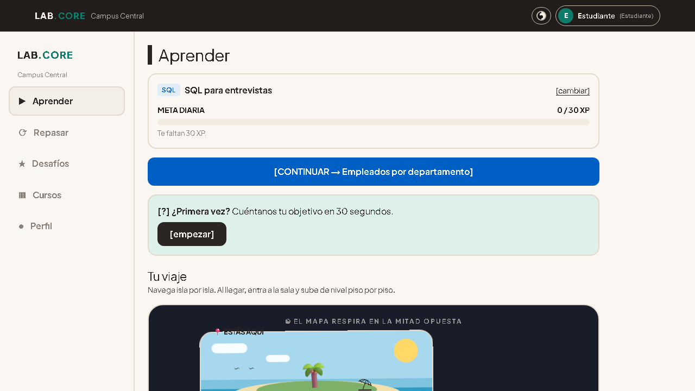
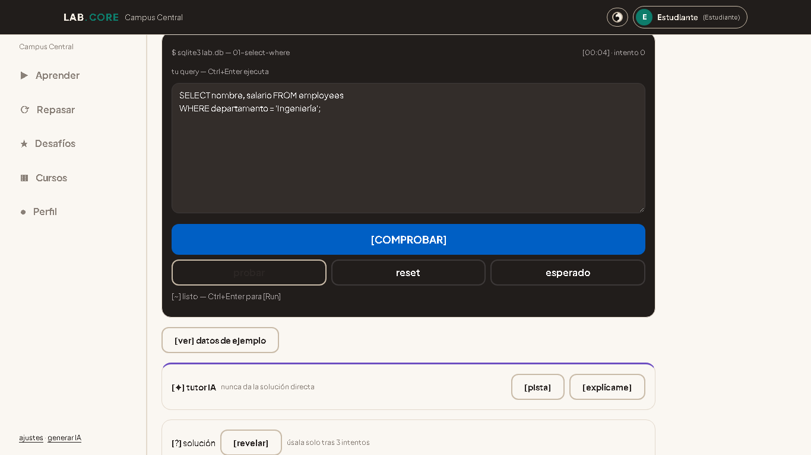
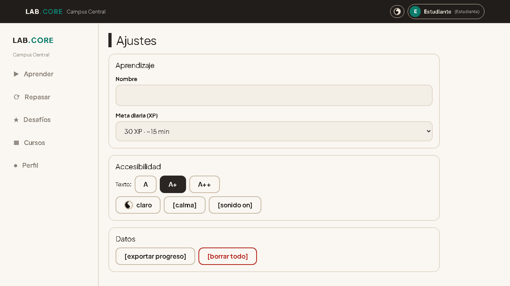

<p align="center">
  <h1 align="center">🧪 Query Lands</h1>
  <p align="center"><strong>Plataforma interactiva de preparación para entrevistas técnicas</strong><br>
  16 retos SQL + 3 retos JS con validación en tiempo real, viaje gamificado por islas, tutor IA y repaso espaciado.<br>
  <a href="https://tech-interview-lab.vercel.app"><strong>🚀 Live Demo » tech-interview-lab.vercel.app</strong></a></p>
  <p align="center">
    
    
    
    
    
    
    
    
    
  </p>
</p>

---

## 🧭 El proyecto en breve

**Máquina de práctica SQL sin instalación**

- **Problema:** Aprender SQL exige instalar entornos y resulta aburrido.
- **Automatización:** 16 retos SQL + 3 de JS corriendo en el navegador, con tutor IA que corrige al instante.
- **Resultado:** Practicas desde el primer clic, con cero fricción.

`Next.js` · `TypeScript` · `SQLite` — [Demo →](https://tech-interview-lab.vercel.app) · [Código →](https://github.com/Marusan94/query-lands)

---

## 📋 Tabla de Contenidos

- [Screenshots](#-screenshots)
- [Demo](#-demo)
- [Features](#-features)
- [Tech Stack](#-tech-stack)
- [Quickstart](#-quickstart)
- [Project Structure](#-project-structure)
- [Roadmap](#-roadmap)
- [License](#-license)

---

## 📸 Screenshots

| Vista | Captura |
|-------|---------|
| Mapa 4 islas + ruta |  |
| Reto SQL (editor + tutor) |  |
| Ajustes (yin-yang + calma) |  |

> Capturadas con Playwright (1366×768) del demo vivo https://tech-interview-lab.vercel.app

## 🎥 Demo en video

[](docs/demo-querylands.mp4)
*Recorrido 90s: mapa islas → reto SQL → tutor IA → logros.*

> Sube `docs/demo-querylands.mp4` a YouTube/Loom y reemplaza este link.

---

## ✨ Features

| Categoría | Detalle |
|-----------|---------|
| **16 Retos SQL** | SELECT → window functions. Ingeniería inversa de DataLemur, HackerRank, StrataScratch, LeetCode DB. Validación por result-sets + tests ocultos anti-memorización |
| **3 Retos JS** | FizzBuzz, palíndromo, agrupa-y-promedia. Tests visibles + ocultos |
| **Viaje por Islas** | 4 islas temáticas animadas, mapa yin-yang, ruta dorada progresiva, velero en isla actual, tesoro final bloqueado/desbloqueado |
| **Salas de Nivel** | Cada isla = torre de pisos N1..Nn con XP, dominio, racha |
| **Simulacro 45 min** | 4 retos mixtos + corrección IA con rúbrica detallada |
| **Tutor IA (Gemini)** | Socrático, explicador, generador de retos auto-validados en SQLite real |
| **Gamificación** | XP, niveles/100, racha + heatmap, monedas, logros, misiones diarias, meta diaria, certificado |
| **Accesibilidad** | Sin negros/blancos puros, modo calma, foco visible, skip-link, texto escalable, sonido off, reduced-motion |
| **Tema** | Claro/oscuro equilibrados como yin-yang + toggle 🌗 en barra superior |
| **Onboarding** | 4 pasos guiados + curso introductorio |

---

## 🛠️ Tech Stack

| Capa | Tecnologías |
|------|-------------|
| **Frontend** | Next.js 16 (App Router), React 19, TypeScript 5, Tailwind 4 |
| **Editor/Validación** | Monaco Editor, `sql.js` (SQLite WASM en browser) |
| **IA** | `@google/generative-ai` (Gemini Flash) |
| **Estado** | `localStorage` (progreso, drafts, mastery, perfil, racha) |
| **Testing** | Vitest + Testing Library (22 tests: curriculum, engine, path, gamificación, prompts, soluciones) |
| **Calidad** | ESLint 9, TypeScript strict |
| **Deploy** | Vercel (automático desde `main`) |

---

## ⚡ Quickstart

```bash
# 1. Clona
git clone https://github.com/Marusan94/query-lands.git
cd query-lands

# 2. Instala (pnpm recomendado)
pnpm install

# 3. Variables de entorno (opcional - sin key los botones IA muestran error amable)
cp .env.local.example .env.local
# GEMINI_API_KEY=tu-key  # tutor, generador, corrección IA

# 4. Desarrollo
pnpm dev
# → http://localhost:3000

# 5. Verificación
pnpm lint
pnpm test      # 22 tests
pnpm build
```

<details>
<summary><strong>Detalles de .env.local</strong></summary>

```bash
# .env.local (solo servidor, NUNCA NEXT_PUBLIC)
GEMINI_API_KEY=tu-key   # habilita: tutor, generador, corrección IA
```

Sin key la app funciona completa: retos, mapa, salas, simulacro, repaso, logros, perfil. Solo los botones [💡] IA muestran error amable.
</details>

---

## 📁 Project Structure

```text
query-lands/
├── public/
│   ├── sql-wasm.js          # SQLite WASM runtime (~46 KB)
│   └── sql-wasm.wasm        # SQLite WASM binary (~658 KB)
├── src/
│   ├── app/                 # Next.js App Router (42 rutas)
│   │   ├── api/             # 3 endpoints IA
│   │   │   ├── tutor/       # Tutor socrático + explicador
│   │   │   ├── generar/     # Generador retos auto-validados
│   │   │   └── correccion/  # Corrección simulacro con rúbrica
│   │   ├── sql/             # Track SQL (16 retos + islas + simulacro)
│   │   ├── js/              # Track JS (3 retos)
│   │   ├── logros/          # Badges, heatmap 8 sem, certificado
│   │   ├── repasar/         # Débiles + programados + rápido
│   │   ├── desafios/        # Misiones diarias/semanales
│   │   ├── perfil/          # Nivel, stats, semana, tiempo
│   │   └── ajustes/         # Tema, calma, fuente, sonido, export/borrar
│   ├── components/          # 26 componentes (runners, mapa, islas, salas, toggles, celebración)
│   │   ├── SqlRunner.tsx    # Editor Monaco + validación SQLite
│   │   ├── JsRunner.tsx     # Runner JS + tests Vitest
│   │   ├── IslaMap.tsx      # Mapa animado 4 islas + velero + ruta
│   │   ├── SalaClient.tsx   # Torre N1..Nn + XP/dominio
│   │   ├── SimulacroClient.tsx
│   │   └── ...
│   └── lib/
│       ├── curriculum.ts    # 16 retos SQL tipados
│       ├── curriculumJs.ts  # 3 retos JS tipados
│       ├── engine.ts        # Comparador result-sets + tests ocultos
│       ├── path.ts          # Lógica islas + progreso ruta
│       ├── progress.ts      # XP, niveles, racha, monedas, logros
│       ├── estado.ts        # Persistencia localStorage
│       ├── logros.ts        # Badges, hitos, certificado
│       └── ai/              # Prompts, provider Gemini
└── DESIGN.md                # Especificación completa (fuente de verdad)
```

---

## 🗺️ Roadmap

- [ ] **Track Python** (Pyodide + WASM)
- [ ] **Liga entre amigos** (ranking local + compartido via link)
- [ ] **Tienda** (gastar monedas en temas, protectores de racha, boosters)
- [ ] **PWA offline** (Service Worker + cache estratégico)
- [ ] **Más retos SQL** (CTEs recursivas, lateral joins, JSON)
- [ ] **Retos TypeScript** (tipado estricto, generics, utility types)

## 🔧 Casos de uso

| Perfil | Qué haces |
|--------|-----------|
| **Estudiante / Junior** | Recorrido guiado 16 retos SQL + 3 JS, tutor IA socrático, repaso espaciado |
| **Entrevista técnica** | Simulacro 45 min con 4 retos mixtos + corrección IA con rúbrica |
| **Calentamiento diario** | Misiones diarias, meta diaria, racha + heatmap 8 semanas |
| **Autodidacta** | Editor Monaco + SQLite WASM en browser, tests visibles + ocultos, solución validada |

---

## 📄 License

Uso personal/educativo. Contenido de práctica original del proyecto.

---

<p align="center">
  <strong>Hecho en Medellín 🇨🇴 por <a href="https://github.com/Marusan94">@Marusan94</a></strong><br>
  <em>Prepárate para la entrevista. Domina el código. Consigue el trabajo.</em>
</p>